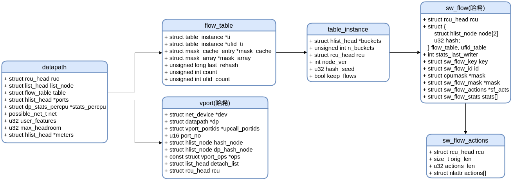

# 数据结构
ovs主要数据结构如下图所示


* 其中，一个datapath代表一个网桥。
* datapath结构体中的ports是一个哈希表保存网桥中的vport。
* datapath结构体中的table为流表
* flow_table为流表结构体，包含所有流表项
* table_instance为某一流表项
* table_instance中的buckets是一个哈希表，保存此流表所属的flow
* sw_flow是流表中的某一个rule
* sw_flow_actions是rule中要执行的操作

## datapath
所在文件: datapath/datapath.h
```c
/**
 * struct datapath - datapath for flow-based packet switching
 * @rcu: RCU callback head for deferred destruction.
 * @list_node: Element in global 'dps' list.
 * @table: flow table.
 * @ports: Hash table for ports.  %OVSP_LOCAL port always exists.  Protected by
 * ovs_mutex and RCU.
 * @stats_percpu: Per-CPU datapath statistics.
 * @net: Reference to net namespace.
 * @max_headroom: the maximum headroom of all vports in this datapath; it will
 * be used by all the internal vports in this dp.
 *
 * Context: See the comment on locking at the top of datapath.c for additional
 * locking information.
 */
struct datapath {
	struct rcu_head rcu;
	struct list_head list_node;

	/* Flow table. */
	struct flow_table table;

	/* Switch ports. */
	struct hlist_head *ports;

	/* Stats. */
	struct dp_stats_percpu __percpu *stats_percpu;

	/* Network namespace ref. */
	possible_net_t net;

	u32 user_features;

	u32 max_headroom;

	/* Switch meters. */
	struct hlist_head *meters;
};
```
其中:
* rcu 一种锁机制
* list_node 网桥哈希链表元素，保存在全局dps列表中（具体在datapath.h文件ovs_net结构体中)
* table 流表
* ports 网桥上端口的哈希链表，这些端口都是用哈希链表来链接
* stats_percpu percpu网桥统计数据
* net net namespace
* user_features
* max_headroom
* meters 交换机计量

## flow_table
所在文件:datapath/flow_table.h
```
struct flow_table {
	struct table_instance __rcu *ti;
	struct table_instance __rcu *ufid_ti;
	struct mask_cache_entry __percpu *mask_cache;
	struct mask_array __rcu *mask_array;
	unsigned long last_rehash;
	unsigned int count;
	unsigned int ufid_count;
};
```
其中: 
* ti 为一个table_instance数组, 一个table_instance代表一个流表
* ufid_ti 为一个table_instance数组，保存ufid类型的flow
* mask_cache
* mask_array
* last_rehash
* count table中flow的个数
* ufid_count table中ufid flow的个数

## table_instance
所在文件: datapath/flow_table.h
```
struct table_instance {
	struct hlist_head *buckets;
	unsigned int n_buckets;
	struct rcu_head rcu;
	int node_ver;
	u32 hash_seed;
	bool keep_flows;
};
```
其中:
* buckets 为hlist_head的数组，保存sw_flow的桶
* n_buckets 为buckets中桶的个数
* rcu rcu锁机制
* node_ver 
* hash_seed 哈希算法需要的种子
* keep_flows 是否保留流表项

## sw_flow
所在文件: datapath/flow.h
```
struct sw_flow {
	struct rcu_head rcu;
	struct {
		struct hlist_node node[2];
		u32 hash;
	} flow_table, ufid_table;
	int stats_last_writer;		/* CPU id of the last writer on
					 * 'stats[0]'.
					 */
	struct sw_flow_key key;
	struct sw_flow_id id;
	struct cpumask cpu_used_mask;
	struct sw_flow_mask *mask;
	struct sw_flow_actions __rcu *sf_acts;
	struct sw_flow_stats __rcu *stats[]; /* One for each CPU.  First one
					   * is allocated at flow creation time,
					   * the rest are allocated on demand
					   * while holding the 'stats[0].lock'.
					   */
};
```
其中:
* rcu rcu锁机制
* hlist_node 
* stats_last_writer
* key 流表中的key
* id 流表中的id
* cpu_used_mask
* mask 要匹配的mask结构体
* sf_acts flow中相应的actions
* stats 流的统计数据

## sw_flow_actions
所在文件: datapath/flow.h
```
struct sw_flow_actions {
	struct rcu_head rcu;
	size_t orig_len;	/* From flow_cmd_new netlink actions size */
	u32 actions_len;
	struct nlattr actions[];
};
```
其中:
* rcu rcu锁机制
* orig_len
* actions_len
* actions

## vport
所在文件: vport.h
```c
/**
 * struct vport - one port within a datapath
 * @dev: Pointer to net_device.
 * @dp: Datapath to which this port belongs.
 * @upcall_portids: RCU protected 'struct vport_portids'.
 * @port_no: Index into @dp's @ports array.
 * @hash_node: Element in @dev_table hash table in vport.c.
 * @dp_hash_node: Element in @datapath->ports hash table in datapath.c.
 * @ops: Class structure.
 * @detach_list: list used for detaching vport in net-exit call.
 * @rcu: RCU callback head for deferred destruction.
 */
struct vport {
	struct net_device *dev;
	struct datapath	*dp;
	struct vport_portids __rcu *upcall_portids;
	u16 port_no;

	struct hlist_node hash_node;
	struct hlist_node dp_hash_node;
	const struct vport_ops *ops;

	struct list_head detach_list;
	struct rcu_head rcu;
};
```
其中:
* dev 指向net_device的指针
* dp  指向此端口所属的datapath
* upcall_portids ？
* port_no 端口号，唯一标识此端口
* hash_node  ？
* dp_hash_node ？
* ops 虚拟端口类型的定义，里面保存端口类型以及操作函数的指针
* detach_list ？
* rcu 一种锁机制(读-拷贝-更新锁机制)

struct net_device结构体是linux中用来描述每一个网络设备的

## ovs_vport_type
所在文件: openvswitch.h
```
enum ovs_vport_type {
	OVS_VPORT_TYPE_UNSPEC,
	OVS_VPORT_TYPE_NETDEV,   /* network device */
	OVS_VPORT_TYPE_INTERNAL, /* network device implemented by datapath */
	OVS_VPORT_TYPE_GRE,      /* GRE tunnel. */
	OVS_VPORT_TYPE_VXLAN,	 /* VXLAN tunnel. */
	OVS_VPORT_TYPE_GENEVE,	 /* Geneve tunnel. */
	__OVS_VPORT_TYPE_MAX
};
```
vport的类型，主要包括:
1. 未分配
2. 网络设备
3. ovs内部设备
4. GRE
5. VXLAN
6. GENEVE


## vport_portids
所在文件: vport.h
```
/**
 * struct vport_portids - array of netlink portids of a vport.
 *                        must be protected by rcu.
 * @rn_ids: The reciprocal value of @n_ids.
 * @rcu: RCU callback head for deferred destruction.
 * @n_ids: Size of @ids array.
 * @ids: Array storing the Netlink socket pids to be used for packets received
 * on this port that miss the flow table.
 */
struct vport_portids {
	struct reciprocal_value rn_ids;
	struct rcu_head rcu;
	u32 n_ids;
	u32 ids[];
};
```
其中:
* rn_ids n_ids的倒数值
* rcu 一种锁机制
* n_ids ids数组中元素的个数
* ids 数组用了保存Netlink套接字的pids

## vport_params
所在文件: vport.h
```c
/**
 * struct vport_parms - parameters for creating a new vport
 *
 * @name: New vport's name.
 * @type: New vport's type.
 * @options: %OVS_VPORT_ATTR_OPTIONS attribute from Netlink message, %NULL if
 * none was supplied.
 * @dp: New vport's datapath.
 * @port_no: New vport's port number.
 */
struct vport_parms {
	const char *name;
	enum ovs_vport_type type;
	struct nlattr *options;

	/* For ovs_vport_alloc(). */
	struct datapath *dp;
	u16 port_no;
	struct nlattr *upcall_portids;
};
```
其中:
* name 虚拟端口名
* type 虚拟端口类型
* options 
* dp 虚拟端口所属的网桥
* port_no 虚拟端口的端口号
* upcall_portids 和Netlink通信时使用的端口id

## vport_ops

```c
/**
 * struct vport_ops - definition of a type of virtual port
 *
 * @type: %OVS_VPORT_TYPE_* value for this type of virtual port.
 * @create: Create a new vport configured as specified.  On success returns
 * a new vport allocated with ovs_vport_alloc(), otherwise an ERR_PTR() value.
 * @destroy: Destroys a vport.  Must call vport_free() on the vport but not
 * before an RCU grace period has elapsed.
 * @set_options: Modify the configuration of an existing vport.  May be %NULL
 * if modification is not supported.
 * @get_options: Appends vport-specific attributes for the configuration of an
 * existing vport to a &struct sk_buff.  May be %NULL for a vport that does not
 * have any configuration.
 * @send: Send a packet on the device.
 * zero for dropped packets or negative for error.
 */
struct vport_ops {
	enum ovs_vport_type type;

	/* Called with ovs_mutex. */
	struct vport *(*create)(const struct vport_parms *);
	void (*destroy)(struct vport *);

	int (*set_options)(struct vport *, struct nlattr *);
	int (*get_options)(const struct vport *, struct sk_buff *);

	netdev_tx_t (*send)(struct sk_buff *skb);
#ifndef USE_UPSTREAM_TUNNEL
	int  (*fill_metadata_dst)(struct net_device *dev, struct sk_buff *skb);
#endif
	struct module *owner;
	struct list_head list;
};
```
其中:
* type 端口类型
* create 一个函数指针，根据指定的参数配置创建一个新的端口
* destroy 一个函数指针，用来销毁端口
* set_options 一个函数指针，用来修改一个已经存在的端口的配置参数
* get_options 一个函数指针，将一个已经存在的端口的配置参数追加到struct sk_buff结构体中
* send 将数据包发送到设备上
* owner
* list

## sw_flow_key
所在文件: flow.h
```
struct sw_flow_key {
	u8 tun_opts[255];
	u8 tun_opts_len;
	struct ip_tunnel_key tun_key;  /* Encapsulating tunnel key. */
	struct {
		u32	priority;	/* Packet QoS priority. */
		u32	skb_mark;	/* SKB mark. */
		u16	in_port;	/* Input switch port (or DP_MAX_PORTS). */
	} __packed phy; /* Safe when right after 'tun_key'. */
	u8 mac_proto;			/* MAC layer protocol (e.g. Ethernet). */
	u8 tun_proto;                   /* Protocol of encapsulating tunnel. */
	u32 ovs_flow_hash;		/* Datapath computed hash value.  */
	u32 recirc_id;			/* Recirculation ID.  */
	struct {
		u8     src[ETH_ALEN];	/* Ethernet source address. */
		u8     dst[ETH_ALEN];	/* Ethernet destination address. */
		struct vlan_head vlan;
		struct vlan_head cvlan;
		__be16 type;		/* Ethernet frame type. */
	} eth;
	/* Filling a hole of two bytes. */
	u8 ct_state;
	u8 ct_orig_pSroto;		/* CT original direction tuple IP
					 * protocol.
					 */
	union {
		struct {
			u8     proto;	/* IP protocol or lower 8 bits of ARP opcode. */
			u8     tos;	    /* IP ToS. */
			u8     ttl;	    /* IP TTL/hop limit. */
			u8     frag;	/* One of OVS_FRAG_TYPE_*. */
		} ip;
	};
	u16 ct_zone;			/* Conntrack zone. */
	struct {
		__be16 src;		/* TCP/UDP/SCTP source port. */
		__be16 dst;		/* TCP/UDP/SCTP destination port. */
		__be16 flags;		/* TCP flags. */
	} tp;
	union {
		struct {
			struct {
				__be32 src;	/* IP source address. */
				__be32 dst;	/* IP destination address. */
			} addr;
			union {
				struct {
					__be32 src;
					__be32 dst;
				} ct_orig;	/* Conntrack original direction fields. */
				struct {
					u8 sha[ETH_ALEN];	/* ARP source hardware address. */
					u8 tha[ETH_ALEN];	/* ARP target hardware address. */
				} arp;
			};
		} ipv4;
		struct {
			struct {
				struct in6_addr src;	/* IPv6 source address. */
				struct in6_addr dst;	/* IPv6 destination address. */
			} addr;
			__be32 label;			/* IPv6 flow label. */
			union {
				struct {
					struct in6_addr src;
					struct in6_addr dst;
				} ct_orig;	/* Conntrack original direction fields. */
				struct {
					struct in6_addr target;	/* ND target address. */
					u8 sll[ETH_ALEN];	/* ND source link layer address. */
					u8 tll[ETH_ALEN];	/* ND target link layer address. */
				} nd;
			};
		} ipv6;
		struct {
			u32 num_labels_mask;    /* labels present bitmap of effective length MPLS_LABEL_DEPTH */
			__be32 lse[MPLS_LABEL_DEPTH];     /* label stack entry  */
		} mpls;
		struct ovs_key_nsh nsh;         /* network service header */
	};
	struct {
		/* Connection tracking fields not packed above. */
		struct {
			__be16 src;	/* CT orig tuple tp src port. */
			__be16 dst;	/* CT orig tuple tp dst port. */
		} orig_tp;
		u32 mark;
		struct ovs_key_ct_labels labels;
	} ct;

} __aligned(BITS_PER_LONG/8); /* Ensure that we can do comparisons as longs. */
```


参考: http://blog.csdn.net/yuzhihui_no1/article/details/39188373   