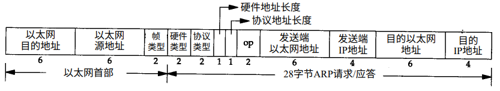

ARP and RARP
===

## ARP
地址解析协议，根据IP地址获取物理地址的一个TCP/IP协议。主机将包含目标IP地址的ARP请求广播到局域网络上的所有主机，并接收返回消息，以此确定目标的物理地址；收到返回消息后将该IP地址和物理地址存入本机缓存中并保留一定时间，下次请求时直接查询ARP缓存。

逆地址解析协议，根据硬件地址获取IP地址的TCP/IP协议。一般用于无盘系统的启动过程。无盘系统的RARP实现过程是从接口卡（网卡）上读取唯一的硬件地址，然后发送一份RARP请求，请求某个主机相应该无盘系统的IP地址。

### 协议
ARP和RARP格式如下图所示

* 以太网首部即在链路层上进行的封装。前两个字段是以太网的源地址和目的地址。目的地址为全1的特殊地址是广播地址。两个字节长的以太网帧类型表示后面数据的类型。对于ARP请求或应答来说，该字段的值是0x0806；对于RARP请求或应答来说，该字段的值为0x8035
* 硬件类型字段表示硬件地址的类型，它的值为1即表示以太网地址
* 协议类型字段表示要映射的协议地址类型，它的值为0x0800即表示IP地址。
* 硬件地址长度是指硬件地址的长度，对于以太网上IP地址的ARP请求或应答来说，它的值为6
* 协议地址长度是指协议地址的长度，对于以太网上IP地址的ARP请求或应答来说，它的值为4
* op-操作字段，四种操作类型，分别是ARP请求（值为1）、ARP应答（值为2）、RARP请求（值为3）和RARP应答（值为4），此值为必须的。
* 发送端硬件地址，顾名思义
* 发送端协议地址，即发送端IP地址
* 目的端的硬件地址
* 目的端的协议地址，对于以太网为IP地址。

对于一个ARP请求来说，除目的端硬件地址外的所有其他的字段都有填充值。当系统收到一份目的端为本机的ARP请求报文后，它就把硬件地址填进去，然后用两个目的端地址分别替换两个发送端地址，并把操作字段置为2，最后把它发送回去。

### ARP代理
如果ARP请求是从一个网络的主机发往另一个网络上的主机，那么连接这两个网络的路由器就可以回答该请求，这个过程称为委托ARP或ARP代理(Proxy ARP)。这样可以欺骗发起ARP请求的发送端，使它误以为路由器就是目的主机，而事实上目的主机是在路由器的”另一边“。路由器的功能相当于目的主机的代理，把分组从其他主机转发给它。
