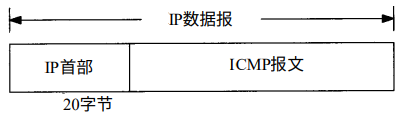
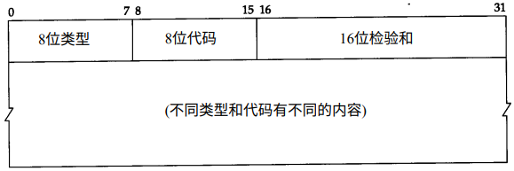

ICMP: Internet控制报文协议
===

ICMP用来传递差错报文以及其他需要注意的信息。ICMP报文通常被IP层或更高层协议(TCP或UDP)使用。一些ICMP报文把差错报文返回给用户进程。

ICMP报文是在IP数据报内部被传输的，如下图所示：

ICMP报文格式如下所示，所有报文的前4个字节都是一样的，但是剩下的其他字节则互不相同。

* 类型字段可以有15个不同的值，以描述特定类型的ICMP报文。
* 某些ICMP报文还使用代码字段的值来进一步描述不同的条件。
* 检验和字段覆盖整个ICMP报文。