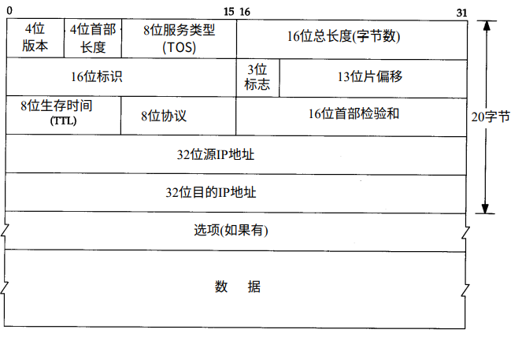

IP协议
===

IP协议提供不可靠、无连接的数据报传送服务。

不可靠的意思是它不能保证IP数据报能够成功地到达目的地。IP仅提供最好的传输服务。如果发生某种错误时，如某个路由器暂时用完了缓冲区，IP有一个简单的错误处理算法：丢弃该数据报，然后发送ICMP消息报给信源端。任何要求的可靠性必须由上层来提供。

无连接的意思是IP并不维护任何关于后续数据报的状态信息。每个数据报的处理是相互独立的。这也说明，IP数据报可以不按发送顺序接收。如果一信源向相同的信宿发送两个连续的数据报（先是A，然后是B），每个数据报都是独立地进行路由选择，可能选择不同的路线，因此B可能在A到达之前先到达。

## IP首部
IP数据报的格式如下图所示。普通IP首部长为20个字节，除非含有选项字段。

1. 首部长度指的是首部占32bit字的数目，包括任何选项。由于它是一个4比特字段，因此首部最长为60个字节。（2**4=16，但0不是一个有效的值，因此最多只有15个32bit字，15*(32/8)=60）

2. 现在大多数的TCP/IP实现都不支持TOS特性

3. 总长度字段是指整个IP数据报的长度，以字节为单位。利用首部长度字段和总长度字段，就可以知道IP数据报中数据内容的起始位置和长度。

4. 标识字段唯一地标识主机发送的每一份数据报。通常每发送一份报文它的值就会加1.

5. 标志字段

6. 片偏移字段

7. 生存时间(TTL)字段设置了数据报可以经过的最多路由器，它指定了数据报的生存时间。TTL的初始值由源主机设置（通常为32或64），一旦经过一个处理它的路由器，它的值就减去1。当该字段的值为0时，数据报就被丢弃，并发送ICMP报文通知源主机。

8. 协议字段

9. 首部检验和字段是根据IP首部计算的检验和码。它不对首部后面的数据进行计算。ICMP、IGMP、UDP和TCP在它们各自的首部中均含有同时覆盖首部和数据检验和码。为了计算一份数据报的IP检验和，首先把检验和字段置为0。然后，对首部中每个16bit进行二进制反码求和（整个首部看成是由一串16bit的字组成），结果存在检验和字段中。当收到一份IP数据报后，同样对首部中每个16bit进行二进制反码的求和。由于接收方在计算过程中包含了发送方存在首部中的检验和，因此，如果首部在传输过程中没有发生任何差错，那么接收方计算的结果应该为全1。如果结果不是全1（即检验和错误），那么IP就丢弃收到的数据报。但是不生成差错报文，由上层去发现丢弃的数据并进行重传。

10. 任选字段是数据报中的一个可变长的可选信息。目前，这些任选项定义如下：
* 安全和处理显示(用于军事领域)
* 记录路径（让每个路由器都记下它的IP地址）
* 时间戳(让每个路由器都记下它的IP地址和时间)
* 宽松的源站选路（为数据报指定一系列必须经过的IP地址）
* 严格的源站选路（与宽松的源站选路类似，但是要求只能经过指定的这些地址，不能经过其他的地址）