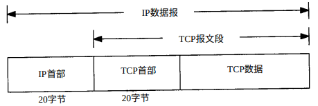
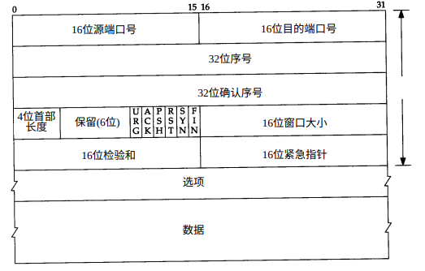

TCP-传输控制协议
===

## 简介

TCP提供一种面向连接的、可靠的字节流服务。

面向连接意味着两个进程在交换数据前必须建立一个TCP连接。

可靠性是指TCP能够保证对端可以接收到自己发送的数据报。TCP通过一下方式提供可靠性:
* 应用数据被分割成TCP认为最适合发送的数据块
* 当TCP发出一个段后，它启动一个定时器，等待目的端确认收到这个报文段。如果不能及时收到一个确认，将重发这个报文段。
* 当TCP收到发自TCP连接另一端的数据，它将发送一个确认。这个确认不是立即发送，通常将推迟几分之一秒。
* TCP将保持它首部和数据的检验和。这是一个端到端的检验和，目的是检测数据在传输过程中的任何变化。如果收到数据段的检验和有差错，TCP将丢弃这个报文段和不确认收到此报文段。
* TCP报文段作为IP数据报来传输，而IP数据报的到达可能会失序，因此TCP报文段的到达也可能会失序。如果必要，TCP将对收到的数据进行重新排序，将收到的数据以正确的顺序交给应用层。
* 既然IP数据报会发生重复，TCP的接收端必须丢弃重复的数据。
* TCP还能提供流量控制。TCP连接的每一方都有固定大小的缓冲空间。TCP的接收端只允许另一端发送接收端缓冲区所能接纳的数据。这将防止较快主机致使较慢主机的缓冲区溢出

## 封装

TCP数据报被封装在一个IP数据报中，格式如下所示

## 首部

TCP数据报的首部格式如下图所示，如果不考虑任选字段，它通常是20个字节

其中：
* 源端口号和目的端口号用来标识发送端进程和接收端进程
* 序号用来标识从TCP发端向TCP收端发送的数据字节流，它表示在这个报文段中的第一个数据字节。如果将字节流看作在两个应用程序间的单向流动，则TCP用序号对每个字节进行计数。序号是32bit的无符号数，序号到达2^32-1后又从0开始。
* 确认序号是上次已成功收到数据字节序号+1，只有ACK标志为1时确认序号字段才有效。
* 首部长度给出首部中32bit字的数目。需要这个值是因为任选字段的长度是可变的。这个字段占4bit，因此TCP最多有60字节的首部。如果没有任选字段，正常的TCP首部长度为20字节。
* 6个标志比特

| 名称 | 含义 |
| --- | --- |
| URG | 紧急指针(urgent pointer)有效 |
| ACK | 确认序号有效 |
| PSH | 接收方应该尽快将这个报文段交给应用层 |
| RST | 重建连接 |
| SYN | 同步序号用来发起一个连接 |
| FIN | 发端完成发送任务 |

* TCP的流量控制由连接的每一端通过声明的窗口大小来提供。窗口大小为字节数，起始于确认序号字段指明的值，这个值是接收端正期望接收的字节。窗口大小是一个16bit字段，因而窗口大小最大为65535字节。
* 检验和覆盖了整个的TCP报文段：TC 首部和TCP数据。这是一个强制性的字段，一定是由发端计算和存储，并由收端进行验证。TCP检验和的计算和UDP检验和的计算相似， 使用一个伪首部
* 只有当URG标志置1时紧急指针才有效。紧急指针是一个正的偏移量，和序号字段中的值相加表示紧急数据最后一个字节的序号。TCP的紧急方式是发送端向另一端发送紧急数据的一种方式。
* 最常见的可选字段是最长报文大小，又称为MSS (Maximum Segment Size)。每个连接方通常都在通信的第一个报文段（为建立连接而设置SYN标志的那个段）中指明这个选项。它指明本端所能接收的最大长度的报文段。