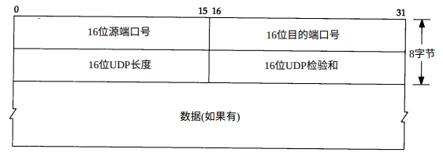

UDP-用户数据报协议
===

## 简介

UDP是一个简单的面向数据报的运输层协议：进程的每个输出操作都正好产生一个UDP数据报，并组装成一份待发送的IP数据报。

UDP不提供可靠性：它把应用程序传给IP层的数据发送出去，但是并不保证它们能到达目的地。

## 封装

UDP数据封装成一份IP数据报，封装的格式如下图所示

## 首部

UDP首部的各字段如下图所示

其中：
* 端口号表示发送进程和接收进程。需要注意的是TCP端口号与UDP端口号是相互独立的。
* UDP长度是指UDP首部和UDP数据的字节长度。该字段的最小值为8字节（只有UDP首部，UDP数据是0）。
* UDP检验和覆盖UDP首部和UDP数据。IP首部的检验和只覆盖IP的首部，并不覆盖IP数据报中的任何数据。

注：
  UDP和TCP在首部中都有覆盖它们首部和数据的检验和，UDP的检验和是可选的，而TCP的检验和是必须的。