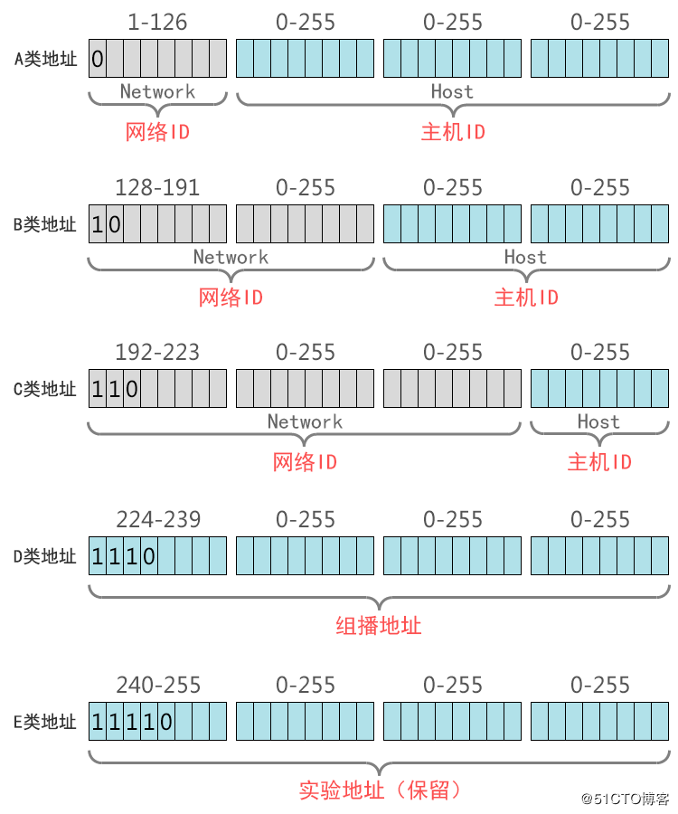

ip地址
===

## IP地址分类
IP地址分为A、B、C、D和E五类，其中A、B、C这三类是比较常用的IP地址，D、E类为特殊IP地址。

### A类地址
1. 地址范围为0.0.0.0~127.255.255.255，主机地址全0(0.0.0.0/8)和全1(127.0.0.0/8)的作为特殊地址，主机地址全1的（127.0.0.0/8)为localhost地址
2. A类网络默认子网掩码为255.0.0.0，也可写作/8
3. A类网络最大主机数量是256×256×256-2=166777214（减去1个主机位为0的网络地址和1个广播地址）

> 在计算机网络中，主机ID全部为0的地址为网络地址，而主机ID全部为1的地址为广播地址，这2个地址是不能分配给主机用的

### B类地址
1. 地址范围128.0.0.0~191.255.255.255
2. B类网络默认子网掩码为255.255.0.0，也可写作/16
3. B类网络最大主机数量256x256-2=6554

### C类地址
1. 地址范围192.0.0.0~223.255.255.255
2. C类网络子网掩码为255.255.255.0，也可写作/24
3. C类网络最大主机数量256-2=254

### D类地址
1. D类地址不分网络地址和主机地址，它的第1个字节的最高位固定是1110
2. D类地址用于组播(也称为多播)的地址，无子网掩码
3. D类地址范围：224.0.0.0~239.255.255.255

### E类地址
1. E类地址也不分网络地址和主机地址，它的第1个字节的最高位固定是11110
2. E类地址范围：240.0.0.0~255.255.255.255
3. 其中240.0.0.0~255.255.255.254作为保留地址，主要用于Internet试验和开发，255.255.255.255作为广播地址

## 私有IP地址
为了弥补IPv4地址日益枯竭的矛盾，在A、B、C类地址中专门划出一小块地址作为全世界各地建设局域网使用，这些划分出来专门作为局域网内网使用的IP地址称为私有网络地址（或称为私网地址，内网地址）

* A类 10.0.0.0~10.255.255.255     保留1个A类网络
* B类 172.16.0.0~172.31.255.255   保留16个B类网络
* C类 192.168.0.0~192.168.255.255 保留256个C类网络

## 子网寻址
现在所有的主机都要求支持子网编码(RFC950)。不是把IP地址看成由单纯的一个网络号和一个主机号组成，而是把主机号再分成一个子网号和一个主机号。

这样做的原因是因为A类和B类地址为主机号分配了太多的空间，可分别容纳的主机数为2^24-2和2^16-2。事实上，在一个网络中并不会安排这么多的主机。

管理员可以对所管理的网络号决定是否建立子网，以及分配多少比特给子网号和主机号。子网对外部路由器来说隐藏了内部网络组织的细节。

## 子网掩码

## 无类别的域间路由选择CIDR