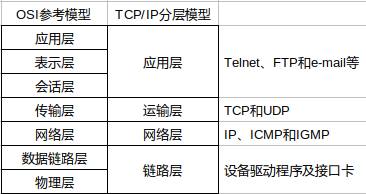
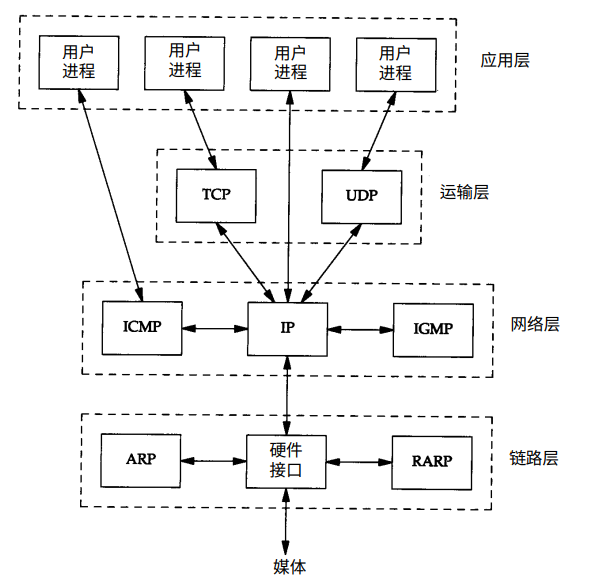

概述
===

网络协议通常分不同层次进行开发，每一层分别负责不同的通信功能。一个协议族，比如TCP/IP，是一组不同层次上的多个协议的组合。TCP/IP通常被认为是一个四层协议系统。ISO/OSI是一个七层协议系统。两者的对应关系如下图所示。

osi七层网络模型虽然未被应用，但了解其各层的含义对理解网络具有重要意义。另外，在网络中的术语二层交换机、三层交换机、三层路由器等都是针对osi七层网络模型而言的。

## osi七层网络模型
osi七层模型中各层包含的网络设备为：
* 物理层：中继器、集线器和双绞线等
* 数据链路层：网桥、二层交换机（以太网交换机）、网卡（其实网卡是一半工作在物理层、一半工作在数据链路层）
* 网络层：路由器和三层交换机
* 传输层：四层交换机也有工作在四层的路由器

### 第一层：物理层
规定通信设备的机械的、电气的、功能的和过程的特性，用以建立、维护和拆除物理链路连接。具体地讲，机械特性规定了网络连接时所需接插件的规格尺寸、引脚数量和排列情况等;电气特性规定了在物理连接上传输bit流时线路上信号电平的大小、阻抗匹配、传输速率 距离限制等;功能特性是指对各个信号先分配确切的信号含义，即定义了DTE和DCE之间各个线路的功能;规程特性定义了利用信号线进行bit流传输的一组 操作规程，是指在物理连接的建立、维护、交换信息是，DTE和DCE双放在各电路上的动作系列。在这一层，数据的单位称为比特(bit)。

### 第二层：数据链路层
在物理层提供比特流服务的基础上，建立相邻节点之间的数据链路，通过差错控制提供数据帧(Frame)在信道上无差错的传输，并进行各电路上的动作系列。数据链路层在不可靠的物理介质上提供可靠的传输。该层的作用包括：物理地址寻址、数据的成帧、流量控制、数据的检错、重发等。在这一层，数据的单位称为帧(frame).

### 第三层：网络层
在计算机网络中进行通信的两个计算机之间可能会经过很多个数据链路，也可能还要经过很多通信子网。网络层的任务就是选择合适的网间路由和交换结点， 确保数据及时传送。网络层将数据链路层提供的帧组成数据包，包中封装有网络层包头，其中含有逻辑地址信息——源站点和目的站点地址的网络地址。如果你在谈论一个IP地址，那么你是在处理第3层的问题，这是“数据包”问题，而不是第2层的“帧”。IP是第3层问题的一部分，此外还有一些路由协议和地 址解析协议(ARP)。有关路由的一切事情都在这第3层处理。地址解析和路由是3层的重要目的。网络层还可以实现拥塞控制、网际互连等功能。在这一层，数据的单位称为数据包(packet)。

### 第四层：传输层
第4层的数据单元也称作数据包(packets)。但是，当你谈论TCP等具体的协议时又有特殊的叫法，TCP的数据单元称为段 (segments)而UDP协议的数据单元称为“数据报(datagrams)”。这个层负责获取全部信息，因此，它必须跟踪数据单元碎片、乱序到达的 数据包和其它在传输过程中可能发生的危险。第4层为上层提供端到端(最终用户到最终用户)的透明的、可靠的数据传输服务。所为透明的传输是指在通信过程中传输层对上层屏蔽了通信传输系统的具体细节。传输层协议的代表包括：TCP、UDP、SPX等。

### 第五层：会话层
这一层也可以称为会晤层或对话层，在会话层及以上的高层次中，数据传送的单位不再另外命名，而是统称为报文。会话层不参与具体的传输，它提供包括访问验证和会话管理在内的建立和维护应用之间通信的机制。如服务器验证用户登录便是由会话层完成的。

### 第六层：表示层
这一层主要解决用户信息的语法表示问题。它将欲交换的数据从适合于某一用户的抽象语法，转换为适合OSI系统内部使用的传送语法。即提供格式化的表示和转换服务。数据的压缩和解压缩、加密和解密等工作都由表示层负责。

### 第七层：应用层
应用层为操作系统或网络应用程序提供访问网络服务的接口。应用层协议的代表包括：Telnet、FTP、HTTP、SNMP等。

## TCP/IP协议
### 链路层
有时也称为数据链路层或网络接口层，通常包括操作系统中的设备驱动程序和计算机中对应的网络接口卡。它们一起处理与电缆（或其他任何传输媒介）的物理接口细节

### 网络层
有时也称作互联网层，处理分组在网络中的活动，例如分组的选路。在TCP/IP协议族中，网络层协议包括IP协议（网际协议），ICMP协议（Internet互联网控制报文协议）以及IGMP协议（Internet组管理协议）。

### 运输层
主要为两台主机上的应用程序提供端到端的通信。在TCP/IP协议中，有两个互不相同的传输协议：TCP(传输控制协议)和UDP(用户数据报协议)。

TCP为两台主机提供高可靠性的数据通信。它所做的工作包括把应用程序交给它的数据分成合适的小块交给下面的网络层，确认接收到的分组，设置发送最后确认分组的超时时钟等。由于运输层提供了高可靠性的端到端的通信，因此应用层可以忽略所有这些细节。而另一方面，UDP则为应用提供一种非常简单的服务。它只是把称作数据报的分组从一台主机发送到另一台主机，但并不保证该数据报能到达另一端。任何必须的可靠性必须由应用层来提供。

### 应用层
负责处理特定的应用程序细节。例如下面几个应用程序：
* Telnet远程登录
* FTP文件传输协议
* SMTP简单邮件传送协议

## TCP/IP的分层
在TCP/IP协议族中，有很多中协议，常见的如下

