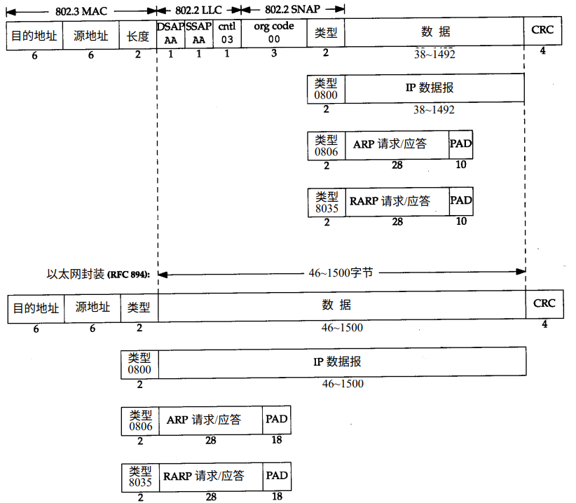

链路层
===

在TCP/IP协议族中，链路层主要有三个目的：
1. 为IP模块发送和接收数据报
2. 为ARP模块发送ARP请求和接收ARP应答
3. 为RARP发送RARP请求和接收RARP应答

## 数据链路层封装格式
最常使用的封装格式是RFC894定义的格式

以太网(RFC894)的帧有最小长度要求，要求最少要有46字节(不包括14字节的以太网帧首部)。为了保证这一点，必须在不足的空间插入填充(pad)字节。

## 最大传输单元MTU
以太网对数据帧的长度有一个限制，其最大值为1500（不包括以太网帧首部和尾部）。链路层的这个特性称作MTU，最大传输单元。

如果IP层有一个数据报要传，而且数据的长度比链路层的MTU还大，那么IP层就需要进行分片(fragmentation)，把数据包分成若干片，这样每一片都小于MTU。